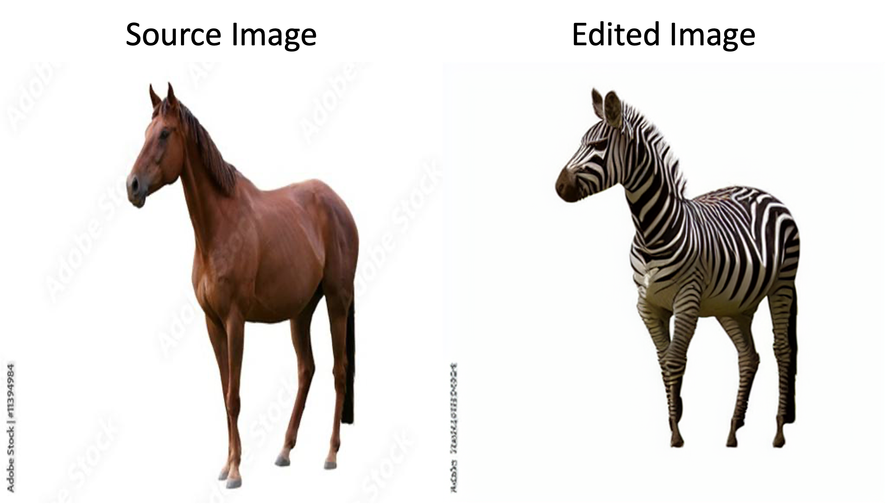
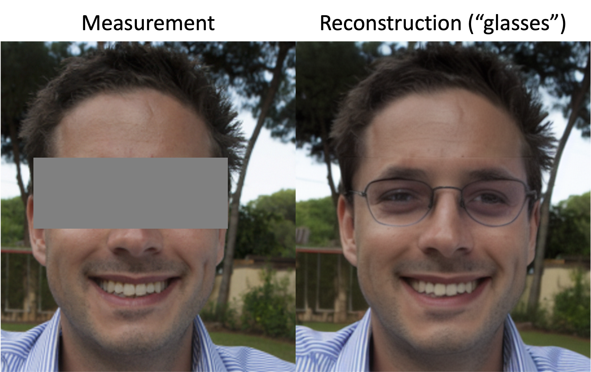

# DreamSampler: Unifying Diffusion Sampling and Score Distillation for Image Manipulation


This is the official implementation of the DreamSampler (ECCV24), led by
[Jeongsol Kim*](https://jeongsol.dev/), [Geon Yeong Park*](https://geonyeong-park.github.io/) and [Jong Chul Ye](https://bispl.weebly.com/professor.html)

Thanks for waiting and sorry for the delayed sharing codebase.


## Abstract

Reverse sampling and score-distillation have emerged as main workhorses in recent years for image manipulation using latent diffusion models (LDMs).
In this paper, we introduce a novel framework called *DreamSampler* which seamlessly integrates two distinct approaches through the lens of regularized latent optimization.

## Setup

First, clone this repository and run the following comment.

```
conda env create -f environment.yaml
```


## Experiment

To conduct text-guided image editing,

```
python run_edit.py
```

If you use the default options, the expected result is




To conduct text-guided inpainting,

```
python run_inpaint.py
```

If you use the default options, the expected result is 




## Citation

```
@article{kim2024dreamsampler,
  title={DreamSampler: Unifying Diffusion Sampling and Score Distillation for Image Manipulation},
  author={Kim, Jeongsol and Park, Geon Yeong and Ye, Jong Chul},
  journal={arXiv preprint arXiv:2403.11415},
  year={2024}
}
```
